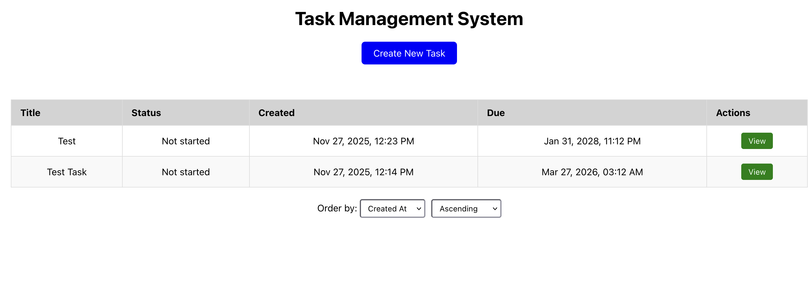
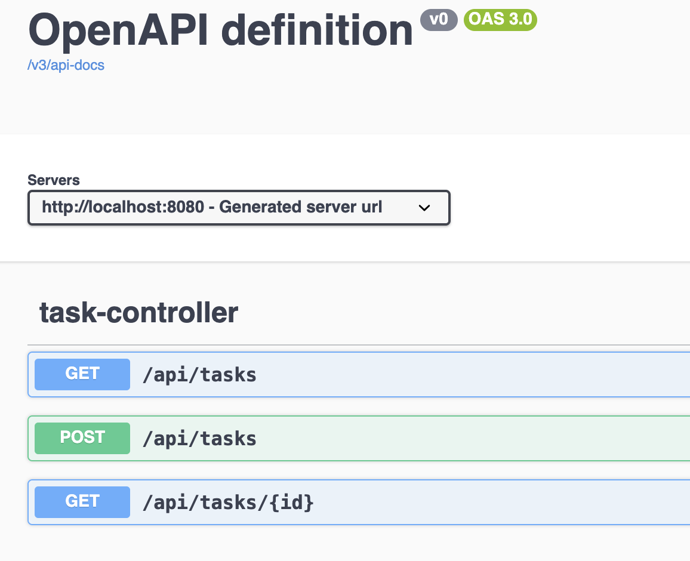

# DTS Technical Task - Junior

- dts -> Backend SpringBoot App
- dts-frontend -> Frontend React App (JS)

**Tech stack**: Java 21, SpringBoot 3.4, React 16.3, H2/Postgres.



## Project approach

Overall my intention with this task was to ensure there was good separation between layers. I ensured distinction between the Data Layer and Domain Service layer for business logic, and carried this idea up through each layer. The reason for this approach is:

- It makes it easier to scale each layer independently.
- I get extra flexibility, e.g. I could swap my React frontend for a different approach without touching the API.
- Extra security, can validate inputs and requests at each layer.
- Separation of layers allows for isolated unit testing of business logic, controllers etc.

### Dev vs Production Environment

My backend can be run in a Development Environment or Production Environment, this is determined by the `SPRING_PROFILES_ACTIVE` environment variable.

In dev environment, there is more verbose logging and we use an h2 database.
In production environment, there is more refined logging - and it is intended to be used with a Postgres DB.

I have included a docker-compose/Dockerfile setup so that it is easy to run my backend in production. Connection details are hard coded in application-production.properties, in real production code this would not be done - I have only done so here for simplicity.

## API endpoints

My backend is configured with swagger / openapi, so please take advantage of that for easy testing.


Only 2 endpoints currently, a simple get query endpoint and post endpoint.

### GET endpoint

`/api/tasks`

Takes a `GetTasksRequest` dto object, to run a paged query for all tasks:

e.g. `GET /api/tasks`

```
{
  "page": 0,
  "size": 1,
  "orderBy": "creationDate",
  "ascending": true
}
```

Valid orderBy options are:

- creationDate
- dueDate

### POST endpoint

`/api/tasks`

Takes a `CreateTaskRequest` dto object, and returns a newly created task.

Request Body:

```
{
  "title": "Refactor React Table Row Component",
  "description": "The Table Row Component needs refactoring - it is too embedded abstract the service logic out of this component.",
  "dueDate": "2026-02-30T12:45"
}
```

Response Body:

```
{
  "id": 1,
  "title": "Refactor React Table Row Component",
  "description": "The Table Row Component needs refactoring - it is too embedded abstract the service logic out of this component.",
  "status": "TO_DO",
  "dueDate": "2026-02-28T12:45:00",
  "createdAt": "2025-11-27T12:47:09"
}
```

Input restrictions:

- A title cannot be null, and also cannot be more than 255 characters.
- A description CAN be null, but can't be more than 1000 characters.
- A due date is required and:
  - Must be more than 1 hour in the future.
  - Cannot be more than 5 years in the future.

## Setup Guides

- Setup guides in separate ReadMe for `dts` and `dts-frontend`

## Next steps/Future Improvements

- Scale the application up
  - Pass in connection strings, passwords by environment variables
  - Increase Validation particularly on controller layer
  - Increased unit testing for frontend
  - Improved logging
- CRUD operations
  - Update
  - Delete
  - Soft Delete
- Improve schema of DB
  - Indexing for faster queries
  - Introduce other entities e.g. comments that could be applied to tasks in One to Many relationship
- Security
  - Spring Security with JWT sessions for authenticated logging in
